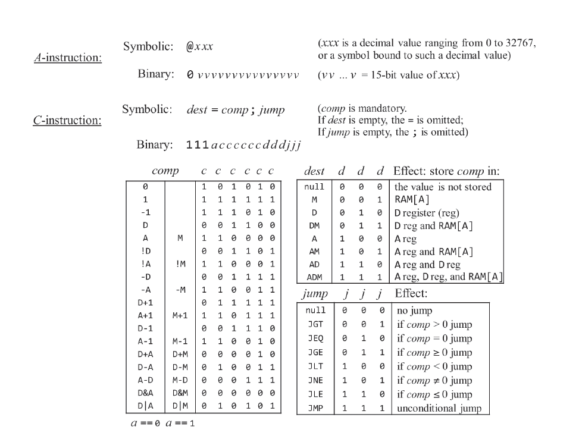

# Machine Language

<!--toc:start-->
- [Machine Language](#machine-language)
  - [Introduction](#introduction)
  - [Hardware Elements](#hardware-elements)
  - [Instructions](#instructions)
  - [Language Specification](#language-specification)
    - [Background](#background)
      - [Memory](#memory)
      - [Registers](#registers)
      - [Addressing](#addressing)
    - [A-Instruction](#a-instruction)
    - [C-Instruction](#c-instruction)
  - [Input/Output](#inputoutput)
    - [Screen Memory Map](#screen-memory-map)
    - [Keyboard Memory Map](#keyboard-memory-map)
  - [Programming](#programming)
    - [Registers and Memory](#registers-and-memory)
    - [Branching](#branching)
    - [Variables](#variables)
    - [Symbols](#symbols)
    - [Iteration](#iteration)
    - [Pointers](#pointers)
    - [Output](#output)
    - [Input](#input)
<!--toc:end-->

## Introduction

- to understand a system or build one, study the function of the system.
  - i.e. study the machine language the platform is designed to realize.
- **machine language** is an agreed upon formalism designed to code machine instructions.
  - instruct the computer's processor to perform arithmetic and logical operations, read and write values from and to the computer's memory, etc.


## Hardware Elements

- **Memory**: continuous sequence of cells, memory registers each having unique addresses.
- **Processor**: perform a fixed set of primitive operations.
  - ALU operations, memory access and control operations.
  - draws inputs from the selected registers and memory locations and writes the outputs to selected registers and memory locations.
- **Registers**: to move data from processor and memory.
  - high speed memory location
  - *data registers*: hold data values
  - *address registers*: hold values that can be interpreted as data values or memory addresses.

## Instructions

- Arithmetic and logical operations are represented by symbolic instruction to execute on a computer.
  - must be translated to binary code 
  - done by **assembler**
- Every machine language has means for accessing and then manipulating, selected memory locations using *address register*.
- Several variants of conditional and unconditional goto instructions as well as label declaration statements that mark the goto destinations is present in machine language.
- Every symbols must be translated to binary code before they can be executed.
- Unlike code that uses physical addresses, the translated binary version of the code that uses symbolic references can be loaded into, and executed from, any memory segment
that happens to be available in the computer's memory.
  - low-level code that mentions no physical addresses is said to be relocatable.

## Language Specification

- Two ways to express the same semantics
  - Binary code
  - Symbolic language

- Symbolic
  
  ```asm
  @17
  D+1;JLE
  ```

- Binary

  ```bin
  0000000000010001
  1110011111000110
  ```



### Background

#### Memory

- two distinct memory
  - **data memory**
    - stores binary values the programs manipulate
    - read/write device
  - instruction memory
    - stores program's instructions represented by binary values.
    - read only device
- both memories are 16-bit wide and each has a 15-bit address space.
- Thus, the maximum addressable size of each memory unit is $2^{15}$ or $32$K 16-bit words.
- each memory unit is a linear sequence of addressable memory registers with address ranging from $0$ to $32K - 1$.

#### Registers

- instructions manipulate three 16-bit registers
  - **data register** `D`
    - store a 16-bit value
  - **address register** `A`
    - serves as both address register and data register
  - **data memory register** `M`

#### Addressing

- `@xxx` sets the `A` register to the value `xxx`.
- it has two side effects:
  - it makes the RAM register whose address is `xxx` the selected memory register, denoted `M`
  - it males the value of the ROM register whose address is `xxx` the selected instruction.
- which action is to be pursued is determined by the subsequent instruction.
- i.e `n`, both `RAM[n]` and `ROM[n]` are selected.


### A-Instruction

- set the register to value
- symbolic syntax

    ```asm
    @value
    //example
    @21 
    ```

  - where value is either
    - a non-negative decimal ($2^{15}-1$)
    - a symbol referring to such a constant
- Binary syntax
  
  ```bin
    0value
    //example
    00000000000010101
  ```

  - where value is a $15$-bit binary number

### C-Instruction

```s
//symbolic
dest=comp;jump

//binary

1 1 1 a c1 c2 c3 c4 c5 c6 d1 d2 d3 j1 j2 j3

opcode [not used] comp      dest     jump
```

- Semantics
  - computes the value of `comp`
  - stores the result in `dest`
  - if the boolean expression (`comp jump 0`) is true
    - jumps to execute the instruction stored in `ROM[A]`

## Input/Output

- how to use machine language to control and manipulate I/O devices.

### Screen Memory Map
  
- designated memory area dedicated to manage a display unit
  - display is continuously refreshed from the memory map
  - output is effected by writing code that manipulates the screen memory map
- display unit
  - $256 \times 512$ b/w
  - 8K,16-bit words = 256*512 = number of pixels in the screen
  - need to access 16-bit as one chunk
  - mapping row-column pair to the memory map
    $$i=32*row+col/16$$
    ```
    1. word = Screen[32*row+col/16]
       word = Ram[16384+32*row+col/16]
    2. set the (col%16)th bit of word to 0 or 1
    3. commit the word to the RAM
    ```

### Keyboard Memory Map

- The physical keyboard is mapped to keyboard memeory map. 
  - need only $16$bits to represent the keyboard
  - so, it is a single $16$-bit register
- when a key is pressed on the keyboard, the key's scan code (a preset value) appers in the keyboard memory map.
- mapping keyboard to memory:
  - probe the contents of the Keyboard chip
  - contents of `RAM[24576]`;
  - if register is $0$, no key is pressed.

## Programming

- assembly instructions are symbolic
- need to translate to binary code $\rightarrow$ **assembler**

### Registers and Memory

- manipulate registers and memory.

    ```
    D: data register
    A: address/data register
    M: currently selected memory register, M=RAM[A]
    ```

- no-op slides

- Built-in symbols
  - 16 virtual registers [`R0-R15`]
  - screen $16384$ [`SCREEN`]
  - keyboard $24576$ [`KBD`]

### Branching

- unconditional and conditional branching
- fundamental ability to tell the computer to evaluate a certain boolean condition and based on the result decide whether to jump and execute some other section of the program
  - `goto`

```asm
// if R0>0 R1=1 else R1=0

@R0
D=M

@THEN
D;JGT

//ELSE
@R1
M=0
@END
0;JMP

(THEN)
@R1
M=1

(END)
@END
0;JMP
```

### Variables

- named value
  - $16$-bit values
  - use registers for variables
- a reference to a symbol that has no corresponding label declaration is treated as a reference to a variable
- variables are allocated to the `RAM` from address $16$ onwards.
- relocatable code

```asm
// swap RAM[0] and RAM[1]
// temp=R1
// R1 = R0
// R0 = temp

@R1
D=M
@temp
M=D   //temp=R1

@R0
D=M
@R1
M=D  //R1=R0

@temp
D=M
@R0
M=D  //R0=temp

(END)
@END
0;JMP
```

### Symbols

- built-in symbols
  - `R0, ... R15` virtual registers
  - `SP, LCL, ARG, THIS, THAT`
  - `SCREEN, KBD`

### Iteration


```basic

// n=...
// sum=0
// for (i=1;i<n;++i) {
//    sum = sum+i;
// }

n=R0
i=1
sum=0
LOOP:
    if i > n goto STOP
    sum=sum+i
    i=i+1
    goto LOOP
STOP:
    R1=sum
```


```asm
@R0
D=M

@n
M=D // n =R0

@i
M=1 // i=1

@sum
M=0 // sum=0


(LOOP)
@i
D=M  

@n
D=D-M  // i-n

@stop
D;JGT // if i-n>0 gotto STOP

@sum
D=M
@i
D=D+M
@sum
M=D
@i
M=M+1
@LOOP
0;JMP

(STOP)
@sum
D=M
@R1
M=D   //RAM[1]=sum

(END)
@END
0;JMP
```

### Pointers

- variables that store memory addresses are called pointers
- set the address register to the contents of some memory register

```asm

// for (i=0;i<n;++i) {
//    arr[i]=-1;
// }

// arr=100
@100
D=A

@arr
M=D

// n=10
@10
D=A
@n
M=D

// i=0
@i
M=0


(LOOP)
    // if (i==n) goto END
    @i
    D=M
    @n
    D=D-M
    @END
    D;JEQ

    // arr[i]=-1
    @arr
    D=M
    @i
    A=D+M  // current address
    M=-1

    // ++i
    @i
    M=M+1

    @LOOP
    0;JMP

(END)
    @END
    0;JMP
```

### Output

- screen memory map

```
 ________
|        |
| data   |
| memory |         
| (16K)  |   
|________| 16384 SCREEN
|        |
| screen |
| memory |         
|   map  | 
|  (8K)  |   
|________| 24576 KBD
| key-   |
| board  |   
|________|
```

```pseudo
for (i=0; i<n; ++i) {
    draw 16 black pixels at the beginning of row i
}


addr = SCREEN
n = RAM[0]
i = 0

LOOP:
    if i > n goto END
    RAM[addr]=-1
    addr=addr+32
    i=i+1
    goto LOOP

END:
    goto END
```


```
@SCREEN
D=A
@addr
M=D  // addr = 16384

@0
D=M
@n
M=D  // n = RAM[0]

@i
M=0  // i = 0

(LOOP)
    @i
    D=M
    @n
    D=D-M
    @END
    D;JGT // if i>n goto END

    @addr
    A=M
    M=-1  // RAM[addr]=-1

    @i
    M=M+1 // i = i+1
    @32
    D=A
    @addr
    M=D+M // addr=addr+32
    @LOOP
    0;JMP

(END)
    @END
    0;JMP
```

### Input

- key memory map

```
@KBD
```
